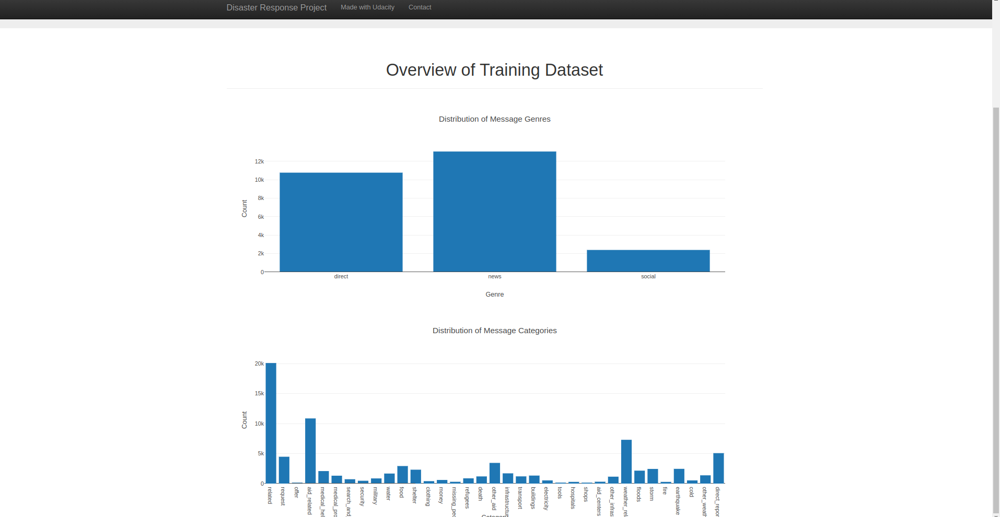
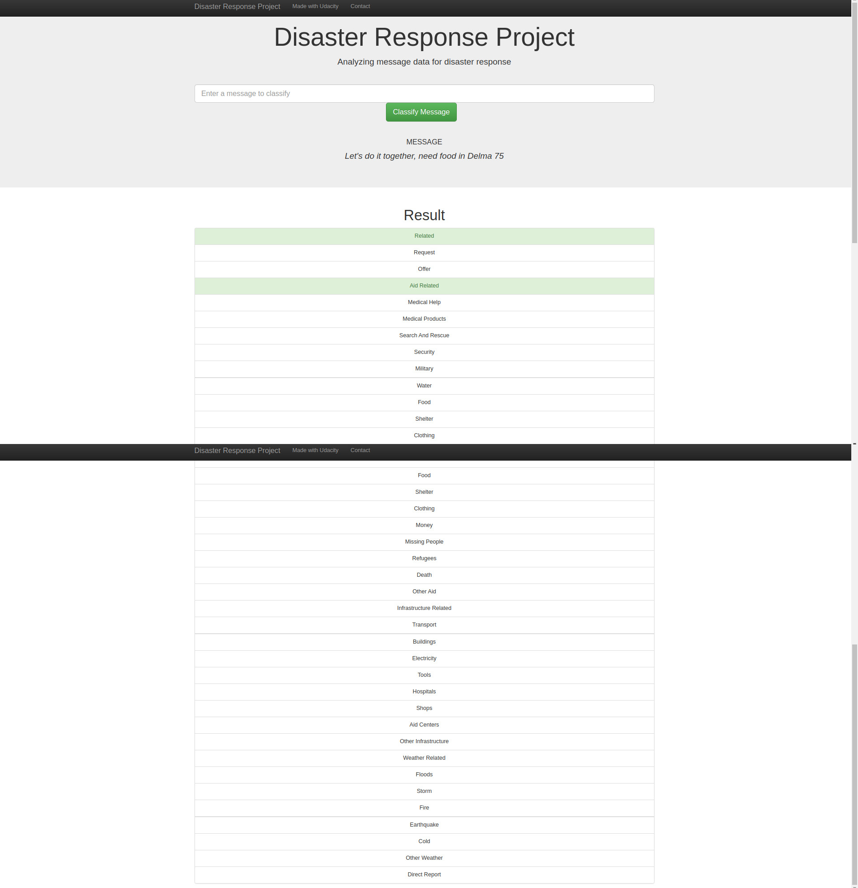

# Disaster Response Pipeline Project
`Disaster Response Pipeline Project` is a web app classifier of a real messages that sent during the disaster events. In this app there are 3 subparts, `ETL Pipeline` ,cleans, merge, and store the data, `ML Pipline` , trains, tune the classifier, and evaluate on the test set, `Flask Web App` interface between user and the code, visaualisation of the dataset.
## Overview
- [Instructions](#instructions-to-run-the-app)
- [Project Structure](#project-structure)
- [Project Components](#project-components)
- [Acknowledgements](#acknowledgements)

### Instructions to run the app:
1. Clone this repository using the command `git clone ...` .
2. Install the required packages using this command `pip install -r requirements.txt`.
3. Run the following commands in the project's root directory to set up your database and model.

    - To run ETL pipeline that cleans data and stores in database
        `python data/process_data.py data/disaster_messages.csv data/disaster_categories.csv data/DisasterResponse.db`
    - To run ML pipeline that trains classifier and saves
        `python models/train_classifier.py data/DisasterResponse.db models/classifier.pkl`

4. Run the following command in the app's directory to run your web app.
    `python run.py`

5. Go to http://0.0.0.0:3001/

### Project Structure: 
```
disaster_response_pipeline_project
├── app
│   ├── templates
│   │   │── go.html
│   │   │── master.html -> file for app
│   │── run.py -> main file to run the app
│── assets
|   |── app_data_vis.png
|   |── app_ml_ex.png
|   |── model's_performance.png
|── data
|   |── disaster_categories.csv -> categories dataset
|   |── disaster_messages.csv -> messages dataset
|   |── DisasterResponse.db -> stored database
|   |── process_data.py -> file for  ETL Pipeline
|── models
|   |── classifier.pkl -> stored model
|   |── train_classifier.py -> file for ML Pipeline
|── ETL Pipeline Preparation.ipynb -> data analysis, cleaning, merging, saving
|── ML Pipeline Preparation.ipynb -> data splititng, tried `RandomForest`, and `AdaBoost` , tuning, storing the model
```
### Project Components:
#### 1. ETL Pipeline : data cleaning pipleine in `process_data.py`
- loads the messages, and categories from the `.csv` files 
- merges the content of the two files in a single dataframe
- remove the duplicate rows, and unwanted columns
- stores the cleaned dataframe as `SQLite` database
#### 2. ML Pipeline : machine learning pipleine in `train_classifier.py`
- loads the saved data frm the `SQLite` database
- splits the dataset into training and testing
- builds a text preprocessing using tokenization
- trains, and tunes the classifier using `GridSearchCV`
- evaluate the model's performance on the test set, and print the performance metrics
- exports the final tuned, trained model as a pickle file
- the example of the `train_classifier.py` on `test set` by `AdaBoostClassifier()`: 
<p align="center">
  
</p>

#### 3. Flask Web App : app files (go.html, and master.html) in the app directory`
- to interact with the project, als to visualise the dataset
- deployement of the project on the web app using flask app
- the example of the `data visualisation` on the app: 
<p align="center">
  
</p>

- the example of the `classification` message showing classified categories in the app  : 
<p align="center">
  
</p>

### Acknowledgements:
- [Udacity](https://www.udacity.com/), for providing the `App-templates`.
- [Appen](https://appen.com/), for providing the dataset.
