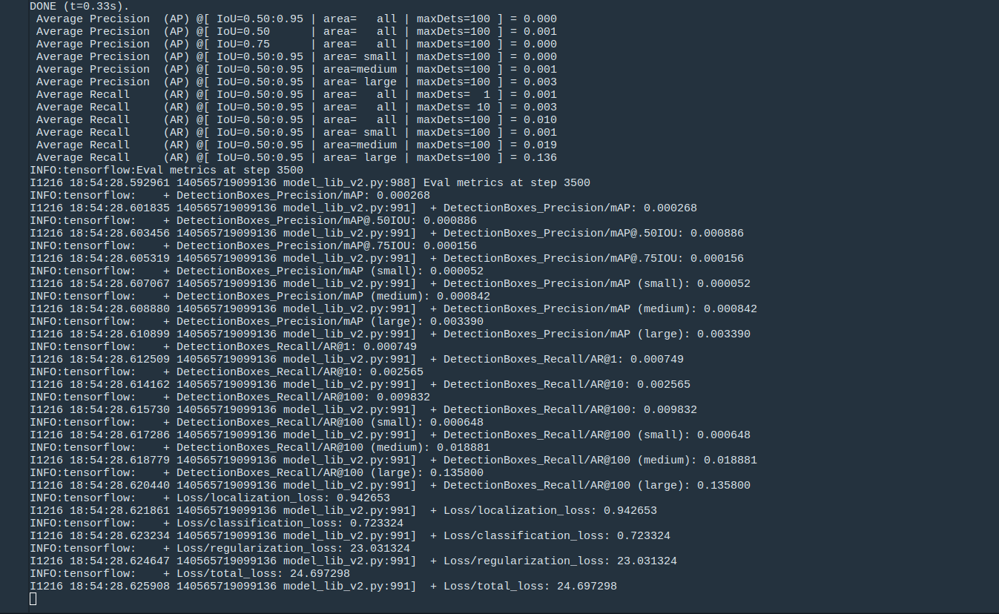
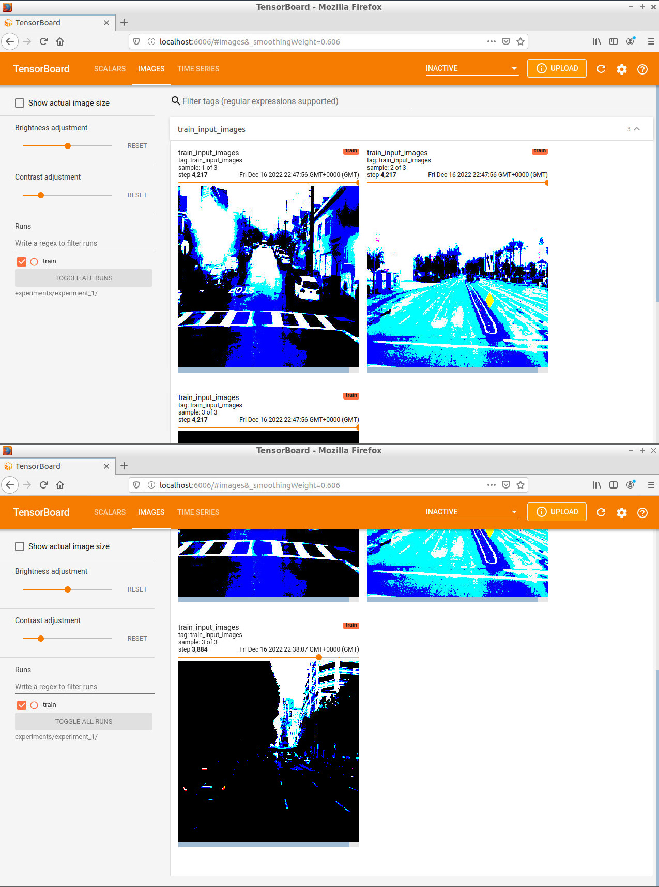
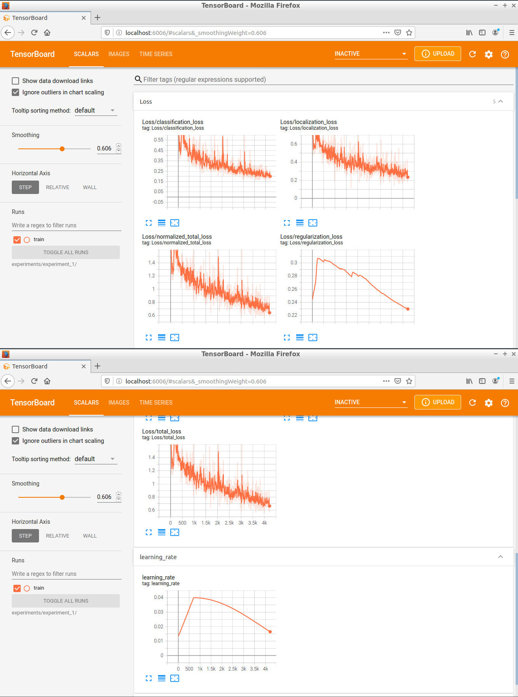
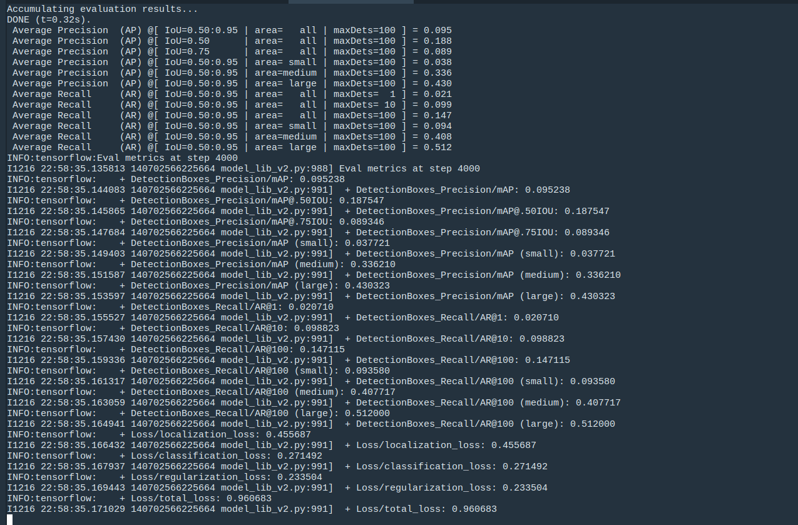
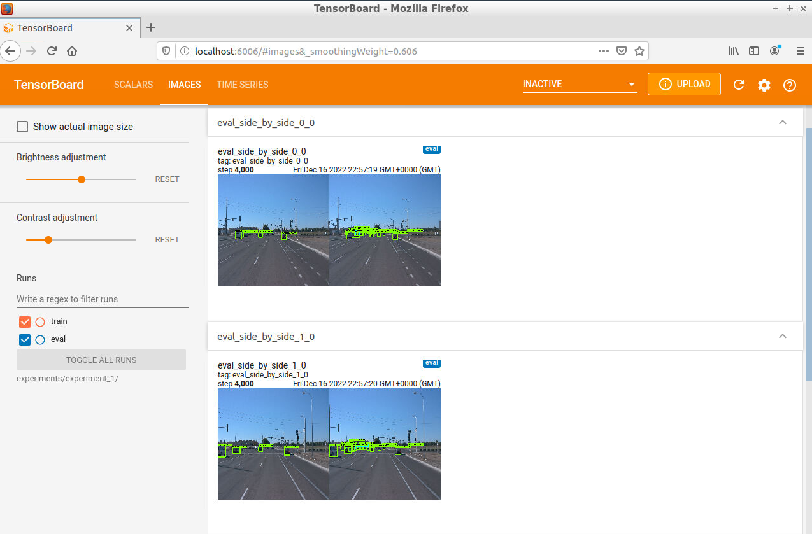

# Object Detection in an Urban Environment
`Object Detection in Urban Environment` is a project to detect the objects in a real world scenario. `Object Detection` is the important component to achieve the fully autonomous driving vehicle. In this project we used the [Waymo Open Dataset](https://waymo.com/open/) to train the model `Single Stage Detector` for the detection of `Car` , `Pedestrian` , and `Cyclist` . 
## Overview
- [Instructions](#instructions-to-setup)
- [Project Structure](#project-structure)
- [Experimental Results](#experimental-results)
	- [Results Reference](#results-reference)
	- [Results Experiment with Improved Performance](#results-experiment-with-improved-performance)
- [Conclusion](#conclusion)
- [Inference Video](#inference-video)

### Instructions to setup:
1. Clone this repository using the command `git clone ...` .
2. Install the required packages using this command `pip install -r requirements.txt`.
3. First, let's download the pretrained model, using this command in CLI;

	`wget http://download.tensorflow.org/models/object_detection/tf2/20200711/ssd_resnet50_v1_fpn_640x640_coco17_tpu-8.tar.gz`
	- Unzip the tar file:
	
		`tar -xvzf ssd_resnet50_v1_fpn_640x640_coco17_tpu-8.tar.gz`
	- Remove the tar file:
	
		`rm -rf ssd_resnet50_v1_fpn_640x640_coco17_tpu-8.tar.gz`
4. Edit the config files to change the location of the training and validation files, as well as the location of the label_map file, pretrained weights

	`python edit_config.py --train_dir /home/workspace/data/train/ --eval_dir /home/workspace/data/val/ --batch_size 2 --checkpoint /home/workspace/experiments/pretrained_model/ssd_resnet50_v1_fpn_640x640_coco17_tpu-8/checkpoint/ckpt-0 --label_map /home/workspace/experiments/label_map.pbtxt`
	- A new config file called `pipeline_new.config` will be created in the `/home/workspace/ directory`. Move this file to the `/home/workspace/experiments/reference/` directory.
5. **Launch the training process** with newly generated `pipeline_new.config` :

	`python experiments/model_main_tf2.py --model_dir=experiments/reference/ --pipeline_config_path=experiments/reference/pipeline_new.config`
	
	- To monitor the training, you can launch a tensorboard instance by running:
	
		`python -m tensorboard.main --logdir experiments/reference/`
	
6. **Launch the evaluation process** with newly generated `pipeline_new.config` :

	`python experiments/model_main_tf2.py --model_dir=experiments/reference/ --pipeline_config_path=experiments/reference/pipeline_new.config --checkpoint_dir=experiments/reference/`
 

7. **Creating an Inference video** 
	- Export the trained model: 
	
		`python experiments/exporter_main_v2.py --input_type image_tensor --pipeline_config_path experiments/reference/pipeline_new.config --trained_checkpoint_dir experiments/reference/ --output_directory experiments/reference/exported/`
	- Create a video of your model's inferences:
	
		`python inference_video.py --labelmap_path label_map.pbtxt --model_path experiments/reference/exported/saved_model --tf_record_path data/test/segment-12200383401366682847_2552_140_2572_140_with_camera_labels.tfrecord --config_path experiments/reference/pipeline_new.config --output_path animation.gif
`

### Project Structure: 
```
object_detection_urban_environment
├── data
│   ├── test -> contain the test data
│   │   │── segment...
│   │── train -> contain the training data 
|   |   │── segment...
│   │── val -> contain the val data 
|   |   │── segment...
│── experiments
|   |── reference -> reference experiment (given config settings)
|   |	|── train 
|   |	|	|── events.out.tfevents -> files for TensorBoard
|   |	|── pipeline_new.config -> generated new config via `edit_config.py`
|   |── experiment_1 -> main experiment with improved performance
|   |	|── train 
|   |	|	|── events.out.tfevents -> files to plot the losses on  TensorBoard
|   |	|── pipeline_new.config -> generated new config via `edit_config.py`, with new parameters, data augmentations
|   |   |── eval
|   |   |   |──events.out.tfevents -> files to plot the losses on  TensorBoard
|   |   |── exported ->
|   |── pretrained_model
|   |   |── ssd_resnet50....
|   |   |── checkpoint
|   |── exporter_main_v2.py -> to create inferecne model, export the trained model
|   |── model_main_tf2.py -> to launch the training
|   |── label_map.pbtext
|── Exploratory Data Analysis.ipynb -> data analysis of the dataset, and visualisation of training images
|── Explore augmentations.ipynb -> script to visualize the augmentations
|── animation.gif
|── edit_config.py -> edit the config files to change the location of the training and validation files
|── filenames.txt
|── inference_video.py -> create a video of the model's inference
|── label_map.pbtxt
|── launch_jupyter.sh
|── pipeline.config
|── requirements.txt -> contains the required packages
|── utils.py 
```
### Experimental Results:
#### Results Reference:

- Different losses on TensorBoard with the given `CONFIG FILE`:

<p align="center">
  
</p>

- Evalutaion result on validation :

<p align="center">
  
</p>

#### Results Experiment with Improved Performance:

- Example of training images to the model:

<p align="center">
  
</p>

- Different losses on TensorBoard with the `Improved CONFIG FILE` :

<p align="center">
  
</p>

- Evalutaion result on validation :

<p align="center">
  
</p>

-  Example of evaluation images to the model:

<p align="center">
  
</p>

### Conclusion:
- **Reference Experiment**:
	- The `classification loss` is around `0.6` , `localisation loss` is around `0.75` , and the combined `total loss` is around `24, 25` . 
	- on the validation the `average recall` is `0.136`, `average precision` is around `0.136` , `total loss` is around `24.69`
	- with this configuration the model was not able to detect the objects on the test images `example`:
			<p align="center">
  
</p>
	
- **Experiment_1 Improved Performance**:
	- The `classification loss` is decreased from `0.6` to `0.20` , `localisation loss` is decreased form `0.75` to `0.35` , and the combined `total loss` is decreased from `24` to `0.65` . 
	- on the validation the `average recall` is increased from `0.136` to `0.512`, `average precision` is increased from `0.136` to `0.430` , `total loss` is decreased from `24.69` to 0.96
	- with this new improved configuration the model was able to detect the objects on the test images `example`: 
- With the increased performance in detections, by adding additional `Data Augmentations`  like `Random Adjust Brightness` , `Random Adjust Hue` , `Random RGB to Gray` proves the importance of `Data Augmentations` in the training of a model.
	
### Inference Video:

<p align="center">

</p>
